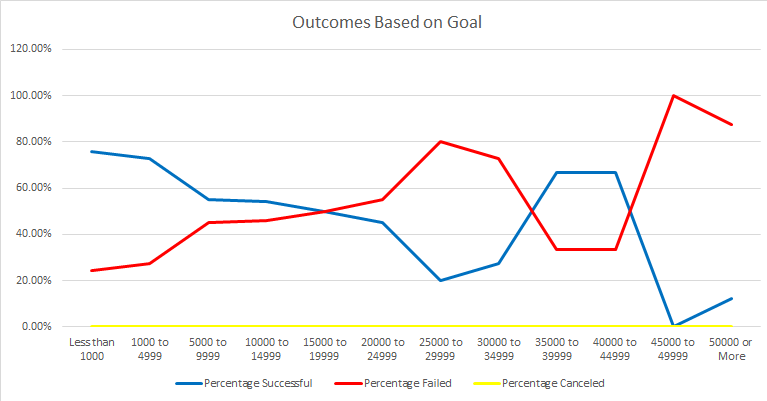

# Kickstarter Trends and Analysis

## Overview of Project
#### We have been tasked by up-and-coming playwright Louise to review, analyze, and determine factors that could make a particular campaign successful. Based on these insights, it will help to determine how they can assist Louise as she embarks on her journey with her own campaign, *Fever*. Our objective is to assist Louise in further understanding different campaigns based on their launch dates and funding goals. Utilizing the Kickstarter dataset, we will investigate campaign outcomes based on this criteria and analyze the outcomes. 

## Analysis and Challenges

### Analysis of Outcomes Based on Launch Date
Theater campaigns were the primary Kickstarter category that Louise wanted to see and compare their launch date. The year in which the campaign was launched was isolated in one column on a master excel worksheet and a pivot table was created to uncover trends based on which particular times of the year campaigns were seen to be most successful, canceled, or failed. Based on the visual obtained through from the pivot table and depicted by the line chart, the months with the most successful campaigns are May, June, and July. Afterwards, there is a steady and slow decline of successful campaigns from August to September. In the month of October successful theater plays slightly peaks, only to then decline for the remainder portion of the year. December is the month with the fewest successful plays, nearly equaling to the amount of those that have failed. Throughout the year there is a steady consistency of low outcome rates for canceled plays, with most plays canceled in January. It should be considered launching the theater play early summertime to take advantage of the higher rate of success this time of year has to offer, and deviate away from launching a play during the fourth quarter of the year. 

### Analysis of Outcomes Based on Goals
Based on the outcomes of number of successful, failed, and canceled plays and taking count of all plays in total of all of the years of the data measured, the most successful plays had goal budget campaigns of between ranging from less than $1k to $9.9k. As the goal amount for theater plays increases, we see a steady decline in the likelihood that the plays will reach a successful outcome. In fact, theater plays who have a goal amount past $19.9k, beginning to see their percent rate of success drop past the 50% threshold. Likewise, at this same level, outcomes for the number of failed plays nearly level out with the successful plays. As the goal amount increases, there is a higher percentage of the goal not being reached and failing. While there are no plays who were not canceled, the chart depicts the trend that the higher the goal amount of a play, the likelihood that it will be successful decreases. 

### Challenges and Difficulties Encountered
A difficulty that could be encountered is the length of time that Louise would like to set to fundraise and reach her campaign goal. The amount of time is unclear how long she could be looking for the next play. Another difficult to take into account is the location of the country. She might change her mind and not decide on the play being in the US, and right now there has been no analysis done of campaigns launched internationally. Further investigation would need to be performed in order to see how much data for other countries we have and if it is enough to provide an accurate analysis that Louise could be successful. 

## Results

### Determined Conclusions on Outcomes based on Launch Date
Based on the data gathered, it is suggested that Louise seek to launch the theater play campaign sometime between the months of May to July. Those months proved to be the most successful campaigns in this category and would be her best option in terms of launching and feeling confident in the chance that it will be successful. The second conclusion that can be drawn is end of year launch dates for plays have a higher risk of not being successful. Louise should steer away from launching the campaign especially in the month of December as the amount of successful campaigns is nearly the same as failed campaigns. That would be a considerable risk to be undertaking as she would have nearly a split chance of the launch date to be successful or not. 

### Conclusion on Outcomes based on Goals
In terms of setting a goal for funding for a theater play campaign, analysis indicates that Louise should set a goal between the ranges of $1k to $4.9k. This range shows that funding goals that stay between these amounts are part of the count with the most successful outcomes for plays, with 388 of them being success, approximately 72.66% of campaign goals. Though the best suggestion for Louise would be to keep its campaign goals as limited and no more than $19.9k if she would like to achieve the best chance for a successful play. Any goal amount surpassing this range, and she increases her chance at failing to reach the goal amount for the play. 

### Dataset Limitations
A limitation that sticks out the most is the last year recorded for information regarding campaign collection was 2017. Given that there has been a time lapse of five years, it might be best to poll more recent data to determine if there are any new or differing trends in comparison to data just going as far as 2017. We also need to obtain from Louise the length of time she is interested to have the theater play campaign open and live. Knowing the length of time can assist in determining a correlation with success and further assist to analyze altogether the outcomes produced by the launch date data and funding goals. Additionally, it would also be helpful to gather analysis on the *backers* on these campaigns.  Whether to determine which are currently donating and determine the count of them more likely to contribute to certain goal funding ranges to see that correlation with the likelihood of success and fail rates. 
### Potential Tables or Graphs to Consider for Future Analyses
One suggestion of a table that could be created is using ranges of amounts, determine the total count of how many backers would donate per each range, essentially the similar layout of the table to determine the success rate of goals set based on funding ranges. It would be interesting to see how many individuals incline to donate more at one level versus the other and how that intertwines with successful and failure rates. Additionally, using the *backers* data, determining the mean, median, and quartiles, for the backers of campaign so Louise can understand the average amount of backers to be expected and using these central tendencies to formulate and set realistic expectations. 
